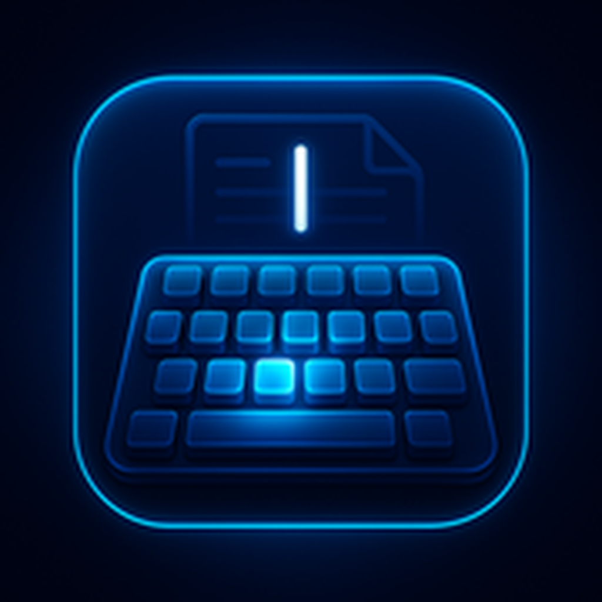

# Auto Typer Studio — Free Auto Typer for Windows

**A small Windows tool that types saved text for you.** Save any snippet — a signature, a code block, a long form answer, a chat command — and press one global hotkey to have it typed into whatever window you're looking at. No copy, no paste, no switching apps.

**Download the latest build:** [AutoTyperStudio.zip](https://github.com/melina-karleen/auto-typer-for-windows/releases/latest/download/AutoTyperStudio.zip) · **Website:** [autotyperstudio.com](https://autotyperstudio.com/)

---

## What it does

Auto Typer Studio types your saved text into any focused window with one global hotkey. It types character by character rather than pasting, so fields that refuse a paste still accept it.

- ⌨️ **Global hotkeys** — one keystroke, snippet types into whichever window has focus (game chat, terminal, form, DM)
- 📝 **Unlimited snippets** — each with its own name, so a long list stays readable
- 🎚️ **Adjustable speed** — from 30 to 3000 characters per minute
- ⏱️ **Optional startup delay** — a few seconds to click into the right field before it starts typing
- 🎯 **Real keystrokes** — types each character individually, so even fields that block paste accept the input
- 💾 **Portable build** — nothing installed, nothing in the registry, delete the folder to remove it
- 🔒 **Free & open** — no ads, no telemetry, no account, no network calls

## Get it running in three minutes

1. **Download** [AutoTyperStudio.zip](https://github.com/melina-karleen/auto-typer-for-windows/releases/latest/download/AutoTyperStudio.zip) from the Releases section
2. **Unzip** anywhere — no installer wizard, no setup
3. **Run** `AutoTyperStudio.exe` — add a snippet, bind a hotkey, click into your target window, press the hotkey

That's it. Alt-Tab into any app or game, hit your hotkey, watch it type.

## What people use it for

- **Repeated messages** — same reply in a support inbox, same greeting in a DM, same command in a game chat
- **Signatures & templates** — email signatures, long-form answers, standard disclaimers
- **Code snippets** — boilerplate that doesn't fit into an IDE snippet manager
- **Form filling** — same address / phone / email into many identical forms
- **Chat commands** — long slash-commands in Discord / MMOs / streaming bots

## Requirements

- **Windows 10 / 11** (64-bit)
- .NET Framework 4.8 (already installed on modern Windows)
- ~40 MB free disk space

The build isn't code-signed yet, so Windows SmartScreen may warn you once — click **More info → Run anyway**.

## FAQ

**Does it work in games?**
Yes — it sends real keyboard events at the OS level, the same as a physical keyboard. Most games accept them. Some anti-cheat systems may not; use responsibly.

**Do I need admin rights?**
No. Regular-user process.

**Can I have multiple hotkeys at once?**
Yes — unlimited snippets, each with its own hotkey and settings.

**Does it need internet?**
No. Zero telemetry, zero network calls. Runs fully offline.

## Full docs and the latest build

Go to **[autotyperstudio.com](https://autotyperstudio.com/)** for the full guide, examples, and community.

## License

MIT — see [LICENSE](LICENSE).

---

*Keywords: auto typer, auto typer for windows, free auto typer, text automation windows, keyboard automation, typing bot, auto type text, snippet expander, global hotkey typer, auto typer studio*
